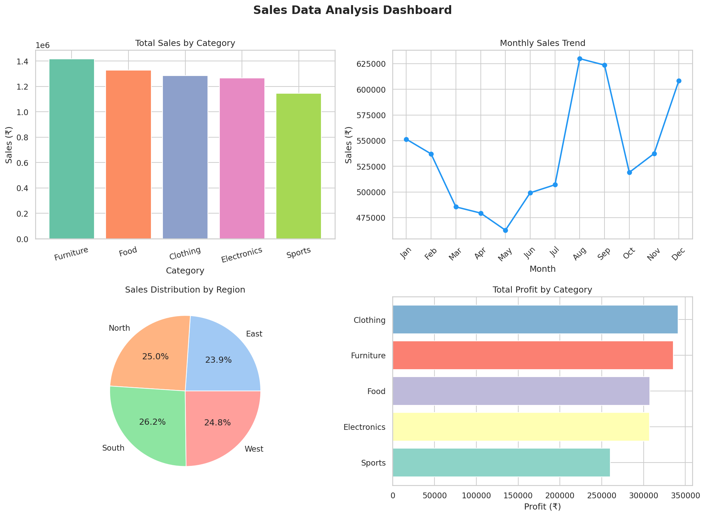

# 📊 Sales Data Analysis

A beginner-friendly data analysis project using Python to analyze sales data and extract business insights through visualizations.

---

## 🛠️ Tools & Libraries Used

- **Python** — core programming language
- **Pandas** — data manipulation and analysis
- **Matplotlib** — data visualization
- **Seaborn** — beautiful statistical charts
- **NumPy** — numerical calculations

---

## 📁 Project Files

| File | Description |
|------|-------------|
| `sales_analysis.py` | Main Python script for analysis |
| `sales_data.csv` | Dataset with 240 rows of sales records |
| `sales_dashboard.png` | Visual dashboard with 4 charts |

---

## 📈 Dashboard Preview



---

## 💡 Key Business Insights

- 💰 **Total Sales** : ₹64,40,671
- 📈 **Total Profit** : ₹15,51,804
- 🏆 **Best Category** : Furniture
- 🌍 **Best Region** : South
- 📅 **Best Month** : August

---

## 📊 What the Dashboard Shows

- **Sales by Category** — which product category performs best
- **Monthly Sales Trend** — how sales change across the year
- **Sales by Region** — which region contributes the most
- **Profit by Category** — which category is most profitable

---

## 🚀 How to Run

1. Clone this repository:
```bash
git clone https://github.com/nthanusha45-learn/sales-data-analysis.git
```

2. Install required libraries:
```bash
pip install pandas matplotlib seaborn numpy
```

3. Run the script:
```bash
python sales_analysis.py
```

---

## 👩‍💻 About Me

I am learning Data Analysis with Python. This is one of my practice projects to build my skills in data exploration and visualization.

Connect with me on [GitHub](https://github.com/nthanusha45-learn) 🙂
